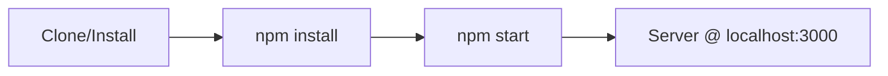

# Simple Server

A minimal HTTP server built with Node.js.

## Prerequisites

- Node.js 18 or later
- npm

## Installation

```bash
npm install
```

## Usage

### Start the server

```bash
npm start
```

The server runs at `http://localhost:3000` by default. Set the `PORT` environment variable to use a different port.

### Run tests

```bash
npm test
```

### Build

```bash
npm run build
```

## Documentation

For detailed API documentation and configuration options, see [docs/SERVER.md](docs/SERVER.md).

## Endpoints

| Endpoint | Description |
|----------|-------------|
| GET /    | Welcome message |
| GET /health | Health check |

## Quick Start


