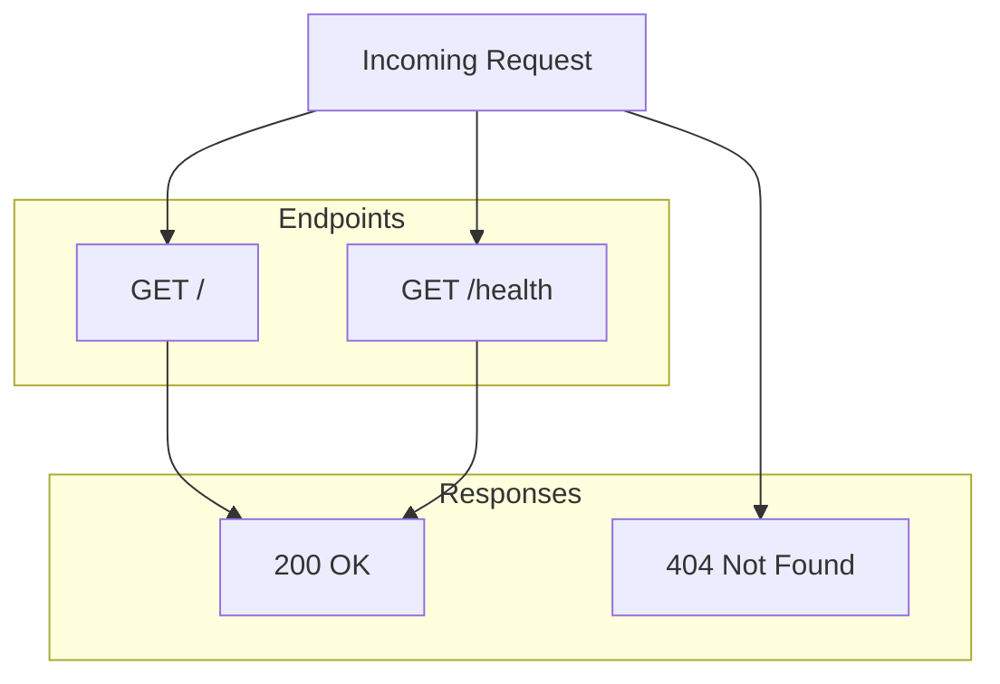

# Simple Server Documentation

## Overview

The simple server is a lightweight HTTP server built with Node.js's built-in `http` module. It serves as a minimal web application providing a welcome endpoint and a health check endpoint for monitoring and load balancer integration. The server is designed for simplicity, with no external dependencies beyond Node.js core modules.

## Configuration

| Variable | Default | Description |
|----------|---------|-------------|
| PORT     | 3000    | Port number the server listens on |

## API Endpoints

### GET /

Returns a welcome message.

**Response:** `200 OK`
- Content-Type: text/plain
- Body: "Welcome to the simple server!"

### GET /health

Health check endpoint for monitoring.

**Response:** `200 OK`
- Content-Type: application/json
- Body: `{ "status": "ok" }`

## Architecture

Request flow:
- Incoming HTTP requests are routed based on the request method and URL path
- `GET /` matches the root path and returns the welcome message
- `GET /health` matches the health path and returns JSON status
- All other requests receive `404 Not Found`
