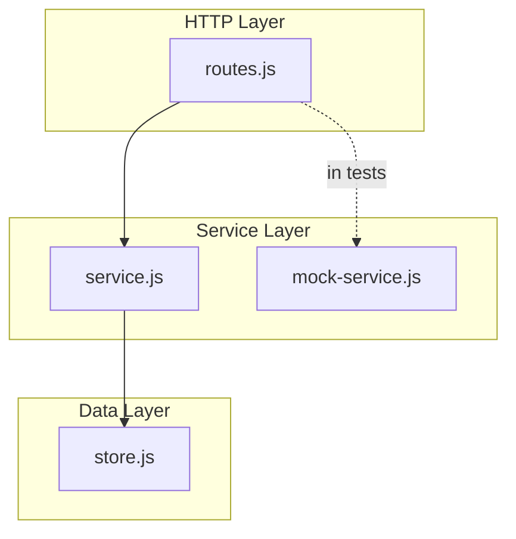
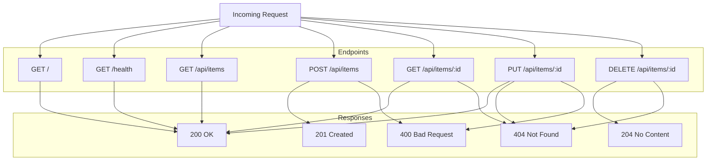

# Simple Server Documentation

## Overview

The simple server is a lightweight HTTP server built with Node.js's built-in `http` module. It serves as a minimal web application providing a welcome endpoint and a health check endpoint for monitoring and load balancer integration. The server is designed for simplicity, with no external dependencies beyond Node.js core modules.

## Configuration

| Variable | Default | Description |
|----------|---------|-------------|
| PORT     | 3000    | Port number the server listens on |

## API Endpoints

### GET /

Returns a welcome message.

**Response:** `200 OK`
- Content-Type: text/plain
- Body: "Welcome to the simple server!"

### GET /health

Health check endpoint for monitoring.

**Response:** `200 OK`
- Content-Type: application/json
- Body: `{ "status": "ok" }`

## REST API

The server exposes a simple REST API for managing items at `/api/items`. All REST responses use `Content-Type: application/json`.

### GET /api/items

List all items.

**Response:** `200 OK`
- Body: Array of item objects, e.g. `[{ "id": "1", "name": "Widget" }]`

### POST /api/items

Create a new item.

**Request:**
- Content-Type: application/json
- Body: JSON object with item properties (e.g. `{ "name": "Widget" }`)

**Response:** `201 Created`
- Body: Created item with `id` and other properties

**Error:** `400 Bad Request` if body is invalid or missing JSON

### GET /api/items/:id

Get item by ID.

**Response:** `200 OK`
- Body: Item object

**Error:** `404 Not Found` if item does not exist

### PUT /api/items/:id

Update an item.

**Request:**
- Content-Type: application/json
- Body: JSON object with properties to update

**Response:** `200 OK`
- Body: Updated item

**Error:** `404 Not Found` if item does not exist
**Error:** `400 Bad Request` if body is invalid or missing JSON

### DELETE /api/items/:id

Delete an item.

**Response:** `204 No Content`
- No body

**Error:** `404 Not Found` if item does not exist

## Service Layer

The REST routes use a **service layer** to access item data. This abstraction allows:

- **Separation of concerns**: Routes handle HTTP; the service handles data operations
- **Testability**: A mock service can be injected for unit testing routes without the real store

### Service Interface

Both `createItemsService` (real) and `createMockItemsService` (mock) implement the same interface:

| Method | Returns | Description |
|--------|---------|-------------|
| `findAll()` | `Array` | List all items |
| `create(data)` | `Object` | Create item, return created item with id |
| `findById(id)` | `Object \| null` | Get item by id |
| `update(id, data)` | `Object \| null` | Update item, return updated item |
| `remove(id)` | `boolean` | Delete item, return true if deleted |

### Real Service

```javascript
const store = require('./rest/store.js');
const { createItemsService } = require('./rest/service.js');

const service = createItemsService(store);
```

### Mock Service (for tests)

```javascript
const { createMockItemsService } = require('./rest/mock-service.js');

// Empty mock
const service = createMockItemsService();

// Pre-populated mock
const service = createMockItemsService({
  initialItems: [{ name: 'Fixture' }]
});
```

### Architecture with Service Layer



## Architecture



Request flow:
- Incoming HTTP requests are routed based on the request method and URL path
- `GET /` matches the root path and returns the welcome message
- `GET /health` matches the health path and returns JSON status
- All other requests receive `404 Not Found`
