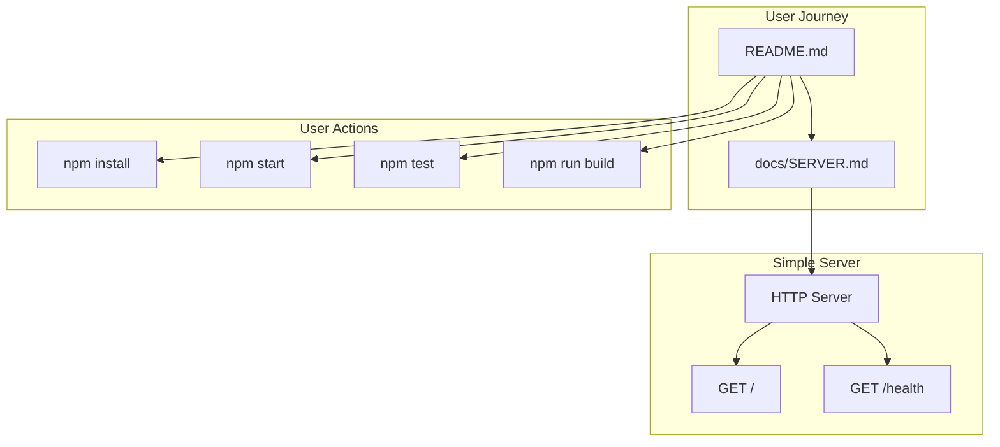
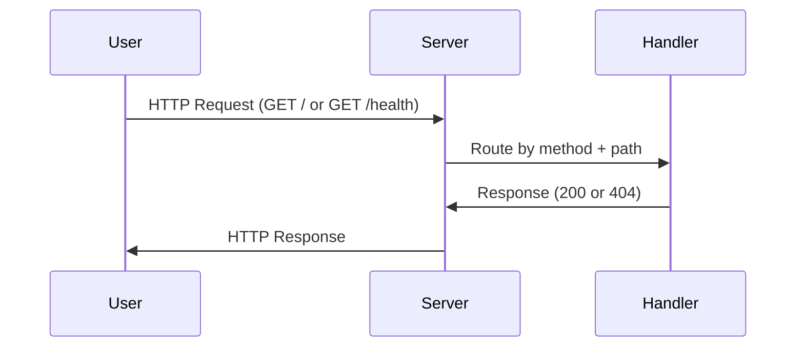
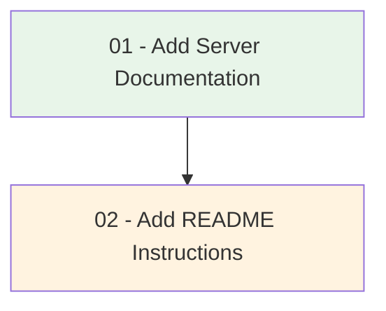

# Implementation Plan: Add Documentation for Simple Server and README Instructions

## High-Level Overview

This plan adds documentation for the simple HTTP server and comprehensive usage instructions to the README. The simple server (at `src/server.js`) is assumed to exist with endpoints `GET /` and `GET /health`. The plan focuses on creating and enhancing documentation artifacts so users and developers can understand, run, and work with the server.

## Architecture

```
┌─────────────────────────────────────────────────────────────────┐
│                        Project Structure                         │
├─────────────────────────────────────────────────────────────────┤
│  README.md           ← User-facing instructions (Step 02)       │
│  docs/                                                          │
│  └── SERVER.md       ← Server API & technical docs (Step 01)     │
│  src/                                                           │
│  └── server.js       ← Simple HTTP server (pre-existing)         │
│  package.json        ← Project config, scripts (pre-existing)    │
│  tests/                                                         │
│  └── server.test.js  ← Server tests (pre-existing)              │
└─────────────────────────────────────────────────────────────────┘
```

## Documentation Flow



## Request Flow (Server)



## Step Dependencies



| Step | Depends On | Output |
|------|------------|--------|
| 01 | None | `docs/SERVER.md` with API reference, configuration, architecture |
| 02 | 01 | `README.md` with setup, usage, and instructions |

## Prerequisites

- **Node.js** (v18+ recommended) installed
- **npm** for package management
- **Simple server** exists at `src/server.js` with `GET /` and `GET /health` endpoints
- **package.json** with scripts: `start`, `build`, `test`

## Scope

- **In scope:** Server documentation (`docs/SERVER.md`), README instructions (`README.md`)
- **Out of scope:** Server implementation changes, new endpoints, deployment configuration

## File Summary

| File | Purpose |
|------|---------|
| `docs/SERVER.md` | Detailed server documentation (API, configuration, architecture) |
| `README.md` | Project overview, quick start, installation, and usage instructions |
