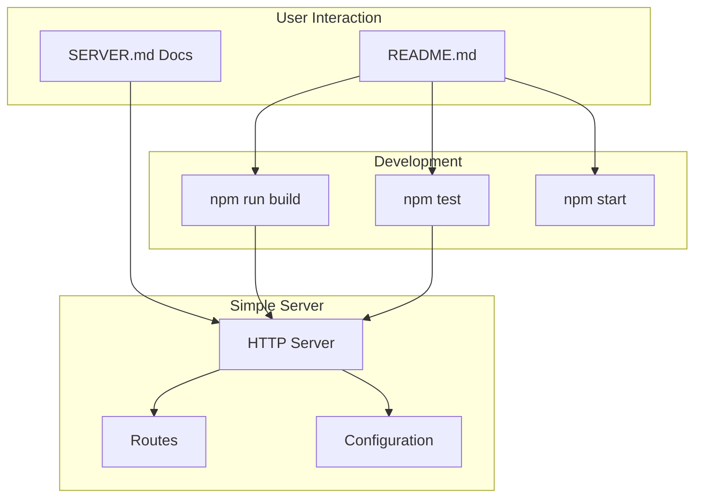
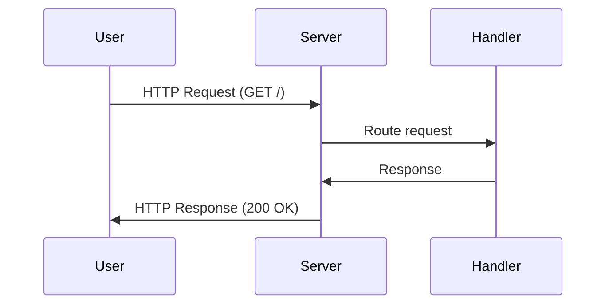
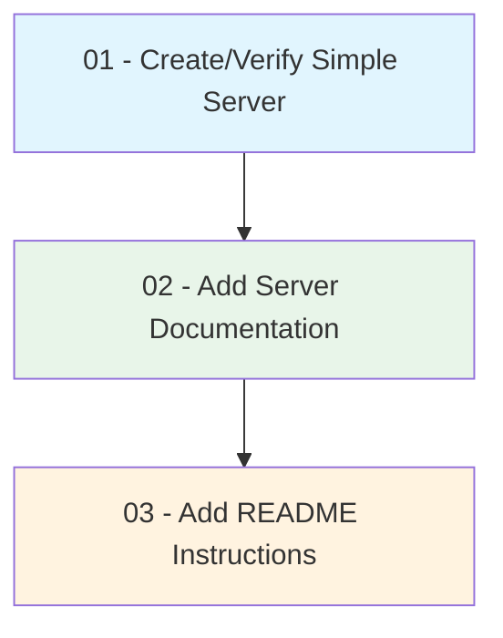

# Implementation Plan: Add Documentation for Simple Server and README Instructions

## High-Level Overview

This plan adds documentation for a simple HTTP server and comprehensive usage instructions to the README. The workspace currently has minimal content (`.gitignore` only), so the plan includes creating a simple Node.js HTTP server if one does not exist, documenting it thoroughly, and providing clear README instructions for users.

## Architecture

```
┌─────────────────────────────────────────────────────────────────┐
│                        Project Structure                         │
├─────────────────────────────────────────────────────────────────┤
│  README.md           ← User-facing instructions (Step 3)        │
│  package.json        ← Project config, scripts (Step 1)          │
│  src/                                                           │
│  └── server.js       ← Simple HTTP server (Step 1)              │
│  docs/                                                          │
│  └── SERVER.md       ← Server documentation (Step 2)             │
│  tests/                                                         │
│  └── server.test.js  ← Server tests (Step 1)                    │
└─────────────────────────────────────────────────────────────────┘
```

## Component Diagram



## Request Flow



## Step Dependencies



| Step | Depends On | Output |
|------|------------|--------|
| 01 | None | Working simple server, package.json, tests |
| 02 | 01 | docs/SERVER.md with API and usage docs |
| 03 | 01, 02 | README.md with setup and usage instructions |

## Prerequisites

- **Node.js** (v18+ recommended) installed on the system
- **npm** (comes with Node.js) for package management
- Text editor or IDE for implementation

## Scope

- **In scope:** Simple HTTP server, server documentation, README with installation and usage instructions
- **Out of scope:** Database integration, authentication, production deployment configuration

## File Summary

| File | Purpose |
|------|---------|
| `src/server.js` | Simple HTTP server implementation |
| `docs/SERVER.md` | Detailed server documentation (API, configuration, architecture) |
| `README.md` | Project overview, quick start, and usage instructions |
| `package.json` | Project metadata and npm scripts |
| `tests/server.test.js` | Server unit tests |
