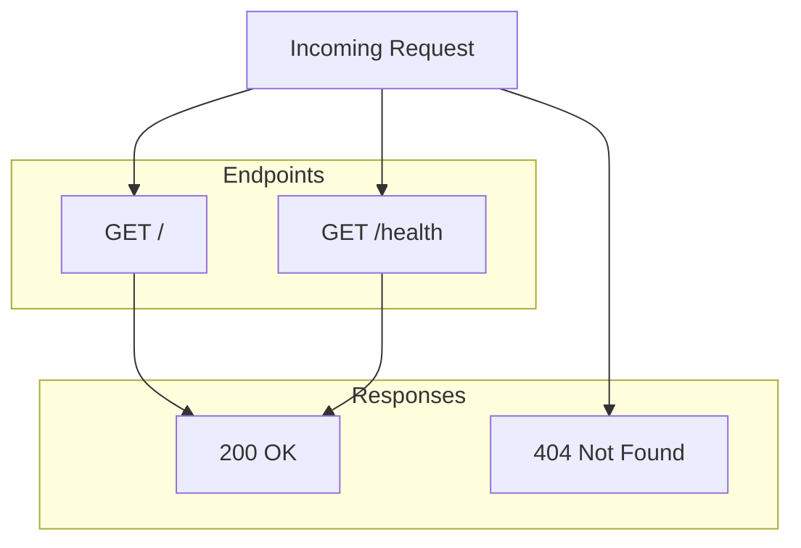
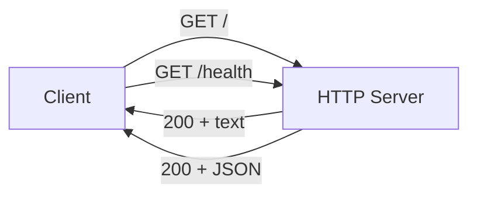

# Step 01: Add Server Documentation

## 1. Goal

Create comprehensive documentation for the simple server in `docs/SERVER.md`. This document serves as the API reference and technical guide for developers working with the server.

## 2. Acceptance Criteria

- [ ] `docs/SERVER.md` exists
- [ ] Documentation includes: overview, API endpoints, configuration options, and architecture
- [ ] All endpoints (`GET /`, `GET /health`) are documented with request/response examples
- [ ] Environment variables (e.g., `PORT`) are documented in a configuration table
- [ ] Architecture section includes a mermaid diagram showing request flow
- [ ] No regressions: `npm run build` and `npm test` still pass

## 3. Files to Modify

| File | Action | Purpose |
|------|--------|---------|
| `docs/SERVER.md` | Create | Server API reference and technical documentation |

## 4. Commands to Run

```bash
npm run build
npm test
```

## 5. New Tests (if applicable)

No new tests required for documentation. Existing tests must continue to pass.

## 6. Code Examples

### docs/SERVER.md Structure

```markdown
# Simple Server Documentation

## Overview

The simple server is a lightweight HTTP server built with Node.js's built-in `http` module. It serves as a minimal web application providing a welcome endpoint and a health check endpoint for monitoring and load balancer integration. The server is designed for simplicity, with no external dependencies beyond Node.js core modules.

## Configuration

| Variable | Default | Description |
|----------|---------|-------------|
| PORT     | 3000    | Port number the server listens on |

## API Endpoints

### GET /

Returns a welcome message.

**Response:** `200 OK`
- Content-Type: text/plain
- Body: "Welcome to the simple server!"

### GET /health

Health check endpoint for monitoring.

**Response:** `200 OK`
- Content-Type: application/json
- Body: `{ "status": "ok" }`

## Architecture



Request flow:
- Incoming HTTP requests are routed based on the request method and URL path
- `GET /` matches the root path and returns the welcome message
- `GET /health` matches the health path and returns JSON status
- All other requests receive `404 Not Found`
```

## 7. Architecture / Mermaid Diagrams



## 8. Commit Message

```
docs: add SERVER.md with API reference and configuration
```
