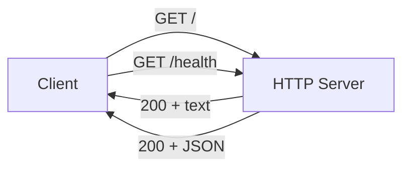

# Step 01: Create Simple Server

## 1. Goal

Set up a minimal Node.js project with a simple HTTP server that responds to requests. This establishes the foundation for documentation and README instructions in subsequent steps.

## 2. Acceptance Criteria

- [ ] `package.json` exists with name, version, and scripts: `start`, `build`, `test`
- [ ] `src/server.js` exists and creates an HTTP server using Node.js built-in `http` module
- [ ] Server listens on configurable port (default 3000) via `PORT` environment variable
- [ ] Server responds to `GET /` with `200 OK` and a welcome message
- [ ] Server responds to `GET /health` with `200 OK` and health status JSON
- [ ] `npm run build` completes without error (or is a no-op if no build step needed)
- [ ] `npm test` runs and all tests pass

## 3. Files to Modify

| File | Action | Purpose |
|------|--------|---------|
| `package.json` | Create | Project metadata, dependencies, npm scripts |
| `src/server.js` | Create | Simple HTTP server implementation |
| `tests/server.test.js` | Create | Unit tests for server endpoints |
| `.gitignore` | Update | Add `node_modules/` and `package-lock.json` if not present |

## 4. Commands to Run

```bash
npm install
npm run build
npm test
```

## 5. New Tests

Add tests in `tests/server.test.js`:

- **Test: GET / returns 200** — Request root path, assert status 200 and body contains welcome message
- **Test: GET /health returns 200** — Request health endpoint, assert status 200 and valid JSON with `status: "ok"`
- **Test: Server uses PORT env** — Start server with custom PORT, verify it listens on that port

Use `node:test` or a lightweight test runner (e.g., `node --test` for Node 18+). If using external test runner, add it to `devDependencies`.

## 6. Code Examples

### package.json

```json
{
  "name": "simple-server",
  "version": "1.0.0",
  "description": "A simple HTTP server",
  "main": "src/server.js",
  "scripts": {
    "start": "node src/server.js",
    "build": "node --check src/server.js",
    "test": "node --test tests/server.test.js"
  },
  "engines": {
    "node": ">=18.0.0"
  }
}
```

### src/server.js (pseudocode)

```javascript
const http = require('http');

const PORT = process.env.PORT || 3000;

const server = http.createServer((req, res) => {
  if (req.method === 'GET' && req.url === '/') {
    res.writeHead(200, { 'Content-Type': 'text/plain' });
    res.end('Welcome to the simple server!');
    return;
  }
  if (req.method === 'GET' && req.url === '/health') {
    res.writeHead(200, { 'Content-Type': 'application/json' });
    res.end(JSON.stringify({ status: 'ok' }));
    return;
  }
  res.writeHead(404);
  res.end('Not Found');
});

server.listen(PORT, () => {
  console.log(`Server running at http://localhost:${PORT}`);
});
```

### tests/server.test.js (pseudocode)

```javascript
const { describe, it } = require('node:test');
const assert = require('node:assert');
const http = require('http');

describe('Simple Server', () => {
  it('GET / returns 200 and welcome message', async () => {
    // Start server, make request, assert response
  });
  it('GET /health returns 200 and status ok', async () => {
    // Assert JSON body has status: "ok"
  });
});
```

## 7. Architecture / Mermaid Diagrams



## 8. Commit Message

```
feat: add simple HTTP server with / and /health endpoints
```
