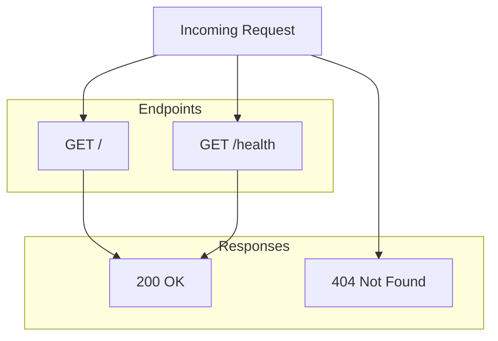

# Step 02: Add Server Documentation

## 1. Goal

Create comprehensive documentation for the simple server in `docs/SERVER.md`. This document will serve as the API reference and technical guide for developers working with the server.

## 2. Acceptance Criteria

- [ ] `docs/SERVER.md` exists
- [ ] Documentation includes: overview, API endpoints, configuration options, and architecture
- [ ] All endpoints (`/`, `/health`) are documented with request/response examples
- [ ] Environment variables (e.g., `PORT`) are documented
- [ ] No regressions: `npm run build` and `npm test` still pass

## 3. Files to Modify

| File | Action | Purpose |
|------|--------|---------|
| `docs/SERVER.md` | Create | Server API reference and technical documentation |

## 4. Commands to Run

```bash
npm run build
npm test
```

## 5. New Tests (if applicable)

No new tests required for documentation. Existing tests must continue to pass.

## 6. Code Examples

### docs/SERVER.md Structure

```markdown
# Simple Server Documentation

## Overview

Brief description of the server, its purpose, and design.

## Configuration

| Variable | Default | Description |
|----------|---------|-------------|
| PORT     | 3000    | Port number the server listens on |

## API Endpoints

### GET /

Returns a welcome message.

**Response:** `200 OK`
- Content-Type: text/plain
- Body: "Welcome to the simple server!"

### GET /health

Health check endpoint for monitoring.

**Response:** `200 OK`
- Content-Type: application/json
- Body: `{ "status": "ok" }`

## Architecture

Include a mermaid diagram or bullet list of request flow.
```

## 7. Architecture / Mermaid Diagrams

Include in `docs/SERVER.md`:



## 8. Commit Message

```
docs: add SERVER.md with API reference and configuration
```
