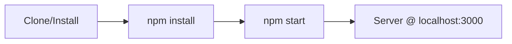

# Step 03: Add README Instructions

## 1. Goal

Create or update `README.md` with clear project overview, installation steps, and usage instructions so users can quickly get the simple server running.

## 2. Acceptance Criteria

- [ ] `README.md` exists at project root
- [ ] README includes: project title, brief description, prerequisites
- [ ] README includes: installation instructions (e.g., `npm install`)
- [ ] README includes: how to run the server (`npm start`)
- [ ] README includes: how to run tests (`npm test`)
- [ ] README includes: link or reference to `docs/SERVER.md` for detailed documentation
- [ ] `npm run build` and `npm test` still pass

## 3. Files to Modify

| File | Action | Purpose |
|------|--------|---------|
| `README.md` | Create | Project overview and user-facing instructions |

## 4. Commands to Run

```bash
npm run build
npm test
```

## 5. New Tests (if applicable)

No new tests required. Documentation changes only.

## 6. Code Examples

### README.md Structure

```markdown
# Simple Server

A minimal HTTP server built with Node.js.

## Prerequisites

- Node.js 18 or later
- npm

## Installation

```bash
npm install
```

## Usage

### Start the server

```bash
npm start
```

The server runs at `http://localhost:3000` by default. Set the `PORT` environment variable to use a different port.

### Run tests

```bash
npm test
```

### Build

```bash
npm run build
```

## Documentation

For detailed API documentation and configuration options, see [docs/SERVER.md](docs/SERVER.md).

## Endpoints

| Endpoint | Description |
|----------|-------------|
| GET /    | Welcome message |
| GET /health | Health check |
```

## 7. Architecture / Mermaid Diagrams

Optional: Add a quick-start flow diagram to README:



## 8. Commit Message

```
docs: add README with installation and usage instructions
```
