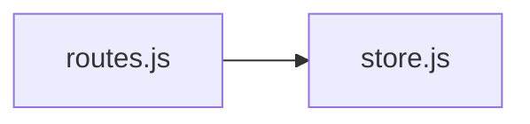
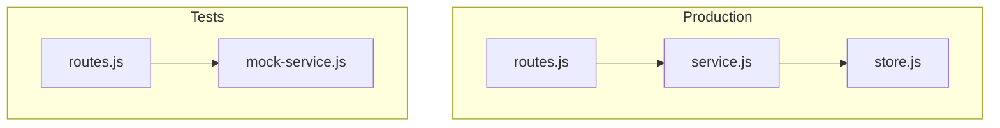
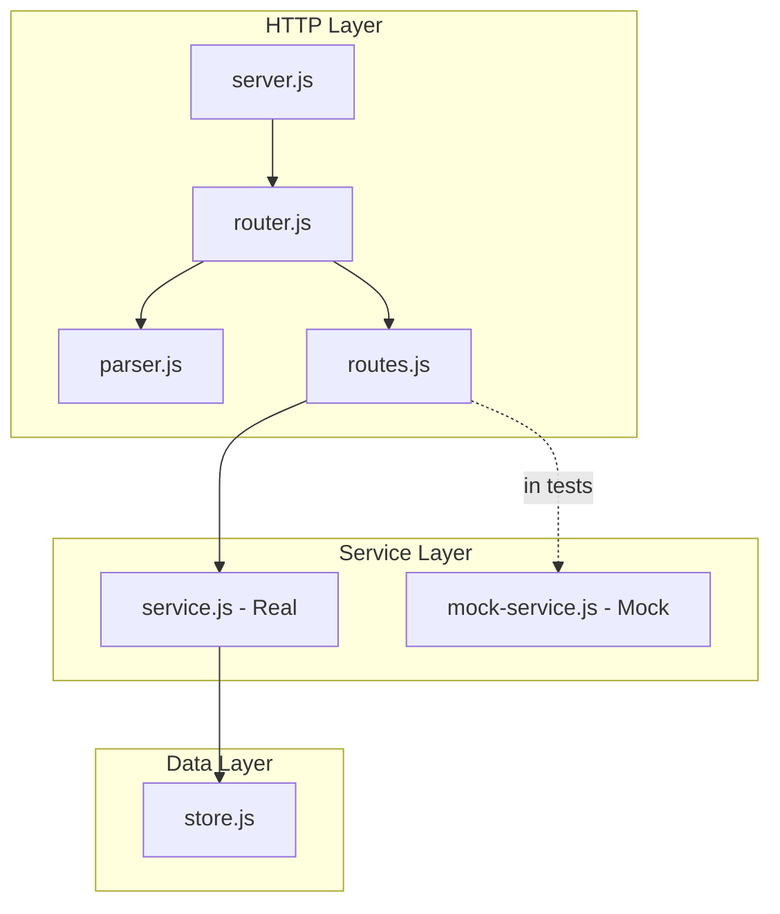
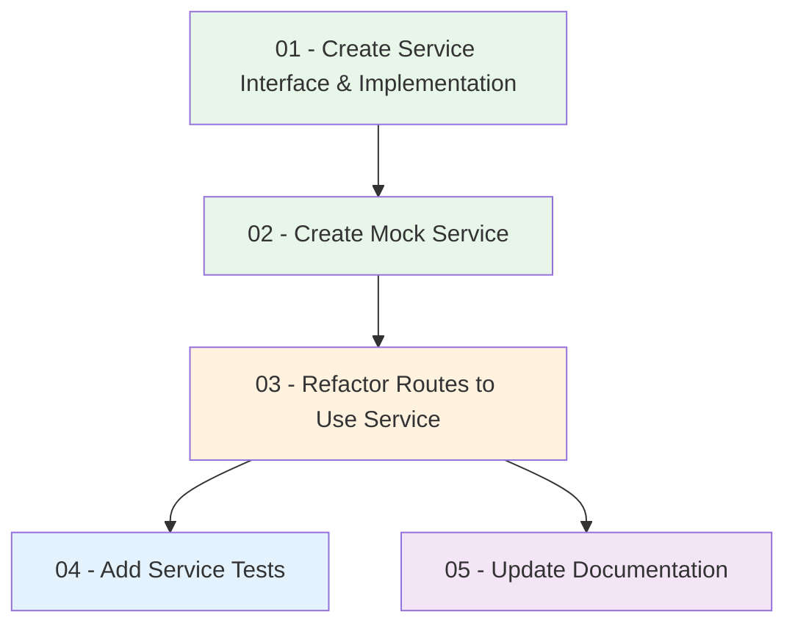

# Implementation Plan: Create a Simple Mock Service Layer

## High-Level Overview

This plan introduces a **service layer** between the REST routes and the in-memory store. The service layer:

- **Abstracts data access**: Routes call the service instead of the store directly
- **Enables mocking**: A mock service implementation can be injected for testing
- **Supports dependency injection**: Both real and mock services implement the same interface

The current flow `Routes → Store` becomes `Routes → Service → Store` (or `Routes → MockService` in tests).

## Architecture

```
┌─────────────────────────────────────────────────────────────────────────────┐
│                     Project Structure (After Implementation)                 │
├─────────────────────────────────────────────────────────────────────────────┤
│  src/                                                                       │
│  ├── server.js              ← HTTP server (wire service into routes)        │
│  └── rest/                                                                  │
│      ├── router.js          ← Route registration & dispatch                 │
│      ├── parser.js          ← Request body parsing                           │
│      ├── routes.js          ← Route handlers (use service, not store)       │
│      ├── service.js         ← Items service interface & real impl (Step 01) │
│      ├── mock-service.js    ← Mock service for tests (Step 02)              │
│      └── store.js           ← In-memory store (unchanged, used by service)  │
│  tests/                                                                     │
│  ├── server.test.js         ← Existing tests                                │
│  ├── rest.test.js           ← REST integration tests                        │
│  └── service.test.js        ← Service layer unit tests (Step 04)           │
│  docs/                                                                      │
│  └── SERVER.md              ← Updated with service layer info (Step 05)     │
└─────────────────────────────────────────────────────────────────────────────┘
```

## Request Flow (Before vs After)

### Before (Current)



### After (With Service Layer)



## Component Diagram



## Service Interface

Both real and mock services implement the same interface:

| Method | Returns | Description |
|--------|---------|-------------|
| `findAll()` | `Array` | List all items |
| `create(data)` | `Object` | Create item, return created item with id |
| `findById(id)` | `Object \| null` | Get item by id |
| `update(id, data)` | `Object \| null` | Update item, return updated item |
| `remove(id)` | `boolean` | Delete item, return true if deleted |

## Step Dependencies



| Step | Depends On | Output |
|------|------------|--------|
| 01 | None | `src/rest/service.js` - real service implementation |
| 02 | 01 | `src/rest/mock-service.js` - mock implementation |
| 03 | 02 | Updated `routes.js`, `server.js` - routes use service |
| 04 | 03 | `tests/service.test.js` - service unit tests |
| 05 | 03 | Updated `docs/SERVER.md` - service layer documentation |

## Prerequisites

- **Node.js** v18+ installed
- **npm** for package management
- **Existing REST layer** at `src/rest/` (router, parser, routes, store)
- **package.json** with scripts: `start`, `build`, `test`

## Scope

- **In scope:** Service interface, real service implementation, mock service, route refactor, unit tests, docs
- **Out of scope:** Database persistence, multiple resource types, complex validation, external frameworks

## File Summary

| File | Purpose |
|------|---------|
| `src/rest/service.js` | Items service interface; real implementation delegating to store |
| `src/rest/mock-service.js` | Mock implementation for testing; configurable static data |
| `src/rest/routes.js` | Refactored to accept service via factory `createRoutes(service)` |
| `src/server.js` | Wires real service into routes |
| `tests/service.test.js` | Unit tests for service and mock service |
| `docs/SERVER.md` | Updated with service layer architecture |
