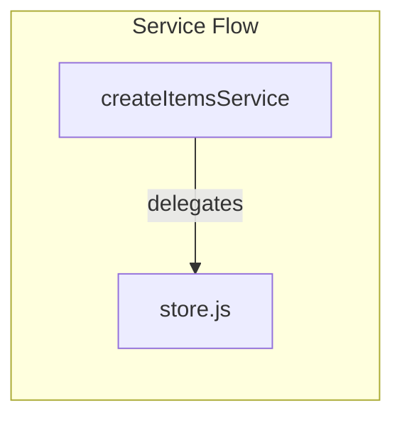

# Step 01: Create Service Interface and Implementation

## Goal

Create a service layer that abstracts item data operations. The service delegates to the existing store and provides a clean interface for the routes to use. This sets the foundation for injecting a mock service in tests.

## Acceptance Criteria

- [ ] `src/rest/service.js` exists
- [ ] Service exports `createItemsService(store)` factory function
- [ ] Service exposes `findAll()`, `create(data)`, `findById(id)`, `update(id, data)`, `remove(id)`
- [ ] All methods delegate to the underlying store
- [ ] `npm run build` passes
- [ ] `npm test` passes (existing tests remain green – routes still use store directly in this step)

## Files to Modify

| File | Action | Purpose |
|------|--------|---------|
| `src/rest/service.js` | Create | Service interface and real implementation |

## Commands to Run

```bash
npm run build
npm test
```

## New Tests (if applicable)

None in this step. The service is not yet wired into routes. Existing integration tests continue to pass.

## Code Examples

### Service Implementation

```javascript
// src/rest/service.js

/**
 * Creates an items service that delegates to the given store.
 * @param {Object} store - Store with create, findAll, findById, update, remove
 * @returns {Object} Items service with findAll, create, findById, update, remove
 */
function createItemsService(store) {
  return {
    findAll() {
      return store.findAll();
    },

    create(data) {
      return store.create(data);
    },

    findById(id) {
      return store.findById(id);
    },

    update(id, data) {
      return store.update(id, data);
    },

    remove(id) {
      return store.remove(id);
    }
  };
}

module.exports = { createItemsService };
```

### Usage (for Step 03)

```javascript
const store = require('./store.js');
const { createItemsService } = require('./service.js');

const service = createItemsService(store);
const items = service.findAll();
const item = service.create({ name: 'Widget' });
```

## Architecture / Mermaid Diagrams



## Commit Message

```
feat(rest): add items service layer with store delegation
```
