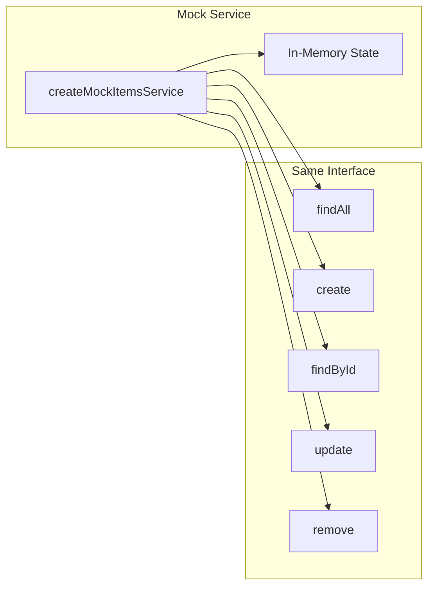

# Step 02: Create Mock Service

## Goal

Create a mock items service that implements the same interface as the real service but returns configurable, predictable data. This enables testing routes and handlers without hitting the real store.

## Acceptance Criteria

- [ ] `src/rest/mock-service.js` exists
- [ ] Mock exports `createMockItemsService(options)` factory
- [ ] Mock implements `findAll()`, `create(data)`, `findById(id)`, `update(id, data)`, `remove(id)`
- [ ] Options can include `initialItems` array for pre-populated data
- [ ] Mock maintains in-memory state for create/update/remove within a test run
- [ ] `npm run build` passes
- [ ] `npm test` passes

## Files to Modify

| File | Action | Purpose |
|------|--------|---------|
| `src/rest/mock-service.js` | Create | Mock service implementation for testing |

## Commands to Run

```bash
npm run build
npm test
```

## New Tests (if applicable)

None in this step. Mock service will be tested in Step 04.

## Code Examples

### Mock Service Implementation

```javascript
// src/rest/mock-service.js

/**
 * Creates a mock items service for testing.
 * Implements the same interface as createItemsService.
 * @param {Object} options - Optional { initialItems: Array }
 * @returns {Object} Mock service with findAll, create, findById, update, remove
 */
function createMockItemsService(options = {}) {
  const { initialItems = [] } = options;
  let items = initialItems.map((item, i) => ({
    id: String(i + 1),
    ...item
  }));
  let nextId = items.length + 1;

  return {
    findAll() {
      return [...items];
    },

    create(data) {
      const newItem = { id: String(nextId++), ...data };
      items.push(newItem);
      return newItem;
    },

    findById(id) {
      return items.find(item => item.id === id) ?? null;
    },

    update(id, data) {
      const index = items.findIndex(item => item.id === id);
      if (index === -1) return null;
      items[index] = { ...items[index], ...data, id };
      return items[index];
    },

    remove(id) {
      const index = items.findIndex(item => item.id === id);
      if (index === -1) return false;
      items.splice(index, 1);
      return true;
    }
  };
}

module.exports = { createMockItemsService };
```

### Usage (for Step 03 / 04)

```javascript
const { createMockItemsService } = require('./mock-service.js');

// Empty mock
const service = createMockItemsService();

// Pre-populated mock
const serviceWithData = createMockItemsService({
  initialItems: [{ name: 'Fixture' }]
});
```

## Architecture / Mermaid Diagrams



## Commit Message

```
feat(rest): add mock items service for testing
```
