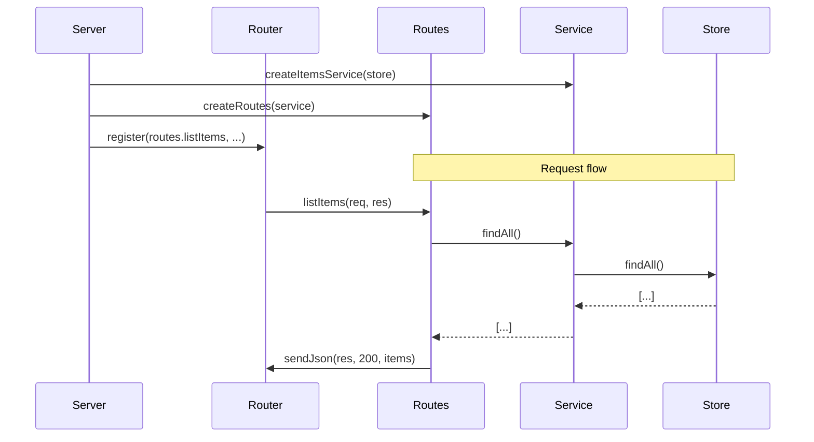

# Step 03: Refactor Routes to Use Service

## Goal

Refactor the routes layer to use the service instead of the store directly. Routes will be created via a factory `createRoutes(service)` so that either the real or mock service can be injected. The server wires the real service; tests can wire the mock.

## Acceptance Criteria

- [ ] `routes.js` exports `createRoutes(service)` instead of individual handlers
- [ ] All route handlers use `service.findAll()`, `service.create()`, etc. instead of `store.*`
- [ ] `server.js` creates service via `createItemsService(store)` and passes it to `createRoutes(service)`
- [ ] Route handlers remain unchanged in behavior (same responses, status codes)
- [ ] `npm run build` passes
- [ ] `npm test` passes (all existing REST tests pass)

## Files to Modify

| File | Action | Purpose |
|------|--------|---------|
| `src/rest/routes.js` | Update | Refactor to factory pattern, use service instead of store |
| `src/server.js` | Update | Wire service into routes |

## Commands to Run

```bash
npm run build
npm test
```

## New Tests (if applicable)

None. Existing `rest.test.js` must continue to pass.

## Code Examples

### Updated routes.js

```javascript
// src/rest/routes.js
const { parseJsonBody } = require('./parser.js');

function sendJson(res, statusCode, data) {
  res.writeHead(statusCode, { 'Content-Type': 'application/json' });
  res.end(JSON.stringify(data));
}

/**
 * Creates route handlers that use the given items service.
 * @param {Object} service - Items service with findAll, create, findById, update, remove
 * @returns {Object} Route handlers { listItems, createItem, getItem, updateItem, deleteItem }
 */
function createRoutes(service) {
  async function listItems(req, res) {
    const items = service.findAll();
    sendJson(res, 200, items);
  }

  async function createItem(req, res) {
    const body = await parseJsonBody(req);
    if (!body || typeof body !== 'object') {
      return sendJson(res, 400, { error: 'Invalid or missing JSON body' });
    }
    const item = service.create(body);
    sendJson(res, 201, item);
  }

  async function getItem(req, res) {
    const { id } = req.params || {};
    const item = service.findById(id);
    if (!item) return sendJson(res, 404, { error: 'Not found' });
    sendJson(res, 200, item);
  }

  async function updateItem(req, res) {
    const { id } = req.params || {};
    const body = await parseJsonBody(req);
    if (!body || typeof body !== 'object') {
      return sendJson(res, 400, { error: 'Invalid or missing JSON body' });
    }
    const item = service.update(id, body);
    if (!item) return sendJson(res, 404, { error: 'Not found' });
    sendJson(res, 200, item);
  }

  async function deleteItem(req, res) {
    const { id } = req.params || {};
    const ok = service.remove(id);
    if (!ok) return sendJson(res, 404, { error: 'Not found' });
    res.writeHead(204);
    res.end();
  }

  return { listItems, createItem, getItem, updateItem, deleteItem };
}

module.exports = { createRoutes };
```

### Updated server.js

```javascript
// src/server.js (relevant section)
const http = require('http');
const { createRouter } = require('./rest/router.js');
const { createRoutes } = require('./rest/routes.js');
const store = require('./rest/store.js');
const { createItemsService } = require('./rest/service.js');

const PORT = process.env.PORT || 3000;

const service = createItemsService(store);
const routes = createRoutes(service);

const router = createRouter();
router.register('GET', '/api/items', routes.listItems);
router.register('POST', '/api/items', routes.createItem);
router.register('GET', '/api/items/:id', routes.getItem);
router.register('PUT', '/api/items/:id', routes.updateItem);
router.register('DELETE', '/api/items/:id', routes.deleteItem);

// ... rest unchanged
```

## Architecture / Mermaid Diagrams



## Commit Message

```
refactor(rest): use service layer in routes with dependency injection
```
