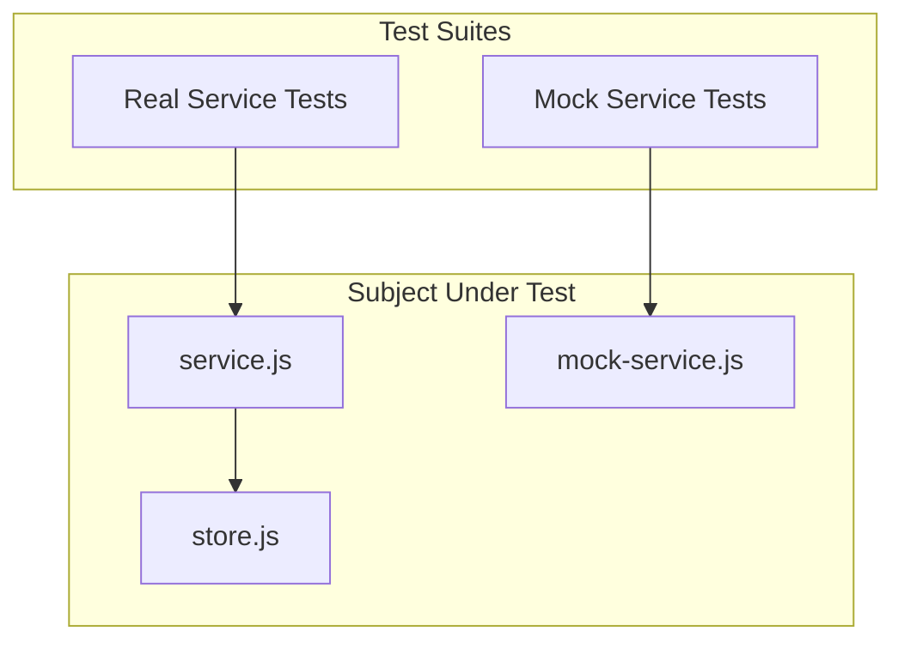

# Step 04: Add Service Tests

## Goal

Add unit tests for the real items service and the mock items service. Verify both implement the interface correctly and produce expected behavior.

## Acceptance Criteria

- [ ] `tests/service.test.js` exists
- [ ] Real service tests: findAll, create, findById, update, remove with real store
- [ ] Mock service tests: findAll, create, findById, update, remove with mock
- [ ] Mock service tests: initialItems option works correctly
- [ ] Tests use `store.reset()` before real service tests to ensure isolation
- [ ] `npm run build` passes
- [ ] `npm test` passes (include new test file in test script)

## Files to Modify

| File | Action | Purpose |
|------|--------|---------|
| `tests/service.test.js` | Create | Unit tests for service and mock service |
| `package.json` | Update | Add `service.test.js` to test script |

## Commands to Run

```bash
npm run build
npm test
```

## New Tests (if applicable)

Create `tests/service.test.js` with the following test suites:

1. **Real Service (createItemsService)**
   - findAll returns empty array when store is empty
   - create adds item and returns it with id
   - findById returns item when found
   - findById returns null when not found
   - update modifies item and returns it
   - update returns null when not found
   - remove returns true when item deleted
   - remove returns false when not found

2. **Mock Service (createMockItemsService)**
   - findAll returns empty array by default
   - create adds item and returns it with id
   - findById returns item when found
   - findById returns null when not found
   - update modifies item and returns it
   - update returns null when not found
   - remove returns true when item deleted
   - remove returns false when not found
   - initialItems pre-populates the mock

## Code Examples

### Test File Structure

```javascript
// tests/service.test.js
const { describe, it, before, beforeEach } = require('node:test');
const assert = require('node:assert');
const { createItemsService } = require('../src/rest/service.js');
const { createMockItemsService } = require('../src/rest/mock-service.js');
const store = require('../src/rest/store.js');

describe('createItemsService (real)', () => {
  let service;

  before(() => {
    service = createItemsService(store);
  });

  beforeEach(() => {
    store.reset();
  });

  it('findAll returns empty array when store is empty', () => {
    const items = service.findAll();
    assert.deepStrictEqual(items, []);
  });

  it('create adds item and returns it with id', () => {
    const item = service.create({ name: 'Test' });
    assert.ok(item.id);
    assert.strictEqual(item.name, 'Test');
    assert.deepStrictEqual(service.findAll(), [item]);
  });

  it('findById returns item when found', () => {
    const created = service.create({ name: 'FindMe' });
    const found = service.findById(created.id);
    assert.strictEqual(found?.name, 'FindMe');
  });

  it('findById returns null when not found', () => {
    assert.strictEqual(service.findById('999'), null);
  });

  it('update modifies item and returns it', () => {
    const created = service.create({ name: 'Original' });
    const updated = service.update(created.id, { name: 'Updated' });
    assert.strictEqual(updated?.name, 'Updated');
  });

  it('update returns null when not found', () => {
    assert.strictEqual(service.update('999', { name: 'X' }), null);
  });

  it('remove returns true when item deleted', () => {
    const created = service.create({ name: 'ToDelete' });
    const ok = service.remove(created.id);
    assert.strictEqual(ok, true);
    assert.strictEqual(service.findById(created.id), null);
  });

  it('remove returns false when not found', () => {
    assert.strictEqual(service.remove('999'), false);
  });
});

describe('createMockItemsService (mock)', () => {
  it('findAll returns empty array by default', () => {
    const service = createMockItemsService();
    assert.deepStrictEqual(service.findAll(), []);
  });

  it('create adds item and returns it with id', () => {
    const service = createMockItemsService();
    const item = service.create({ name: 'Mock' });
    assert.ok(item.id);
    assert.strictEqual(item.name, 'Mock');
  });

  it('initialItems pre-populates the mock', () => {
    const service = createMockItemsService({
      initialItems: [{ name: 'Pre' }]
    });
    const items = service.findAll();
    assert.strictEqual(items.length, 1);
    assert.strictEqual(items[0].name, 'Pre');
    assert.ok(items[0].id);
  });

  // ... similar tests for findById, update, remove
});
```

### package.json Update

```json
{
  "scripts": {
    "test": "node --test tests/server.test.js tests/rest.test.js tests/service.test.js"
  }
}
```

## Architecture / Mermaid Diagrams



## Commit Message

```
test(rest): add unit tests for service and mock service
```
