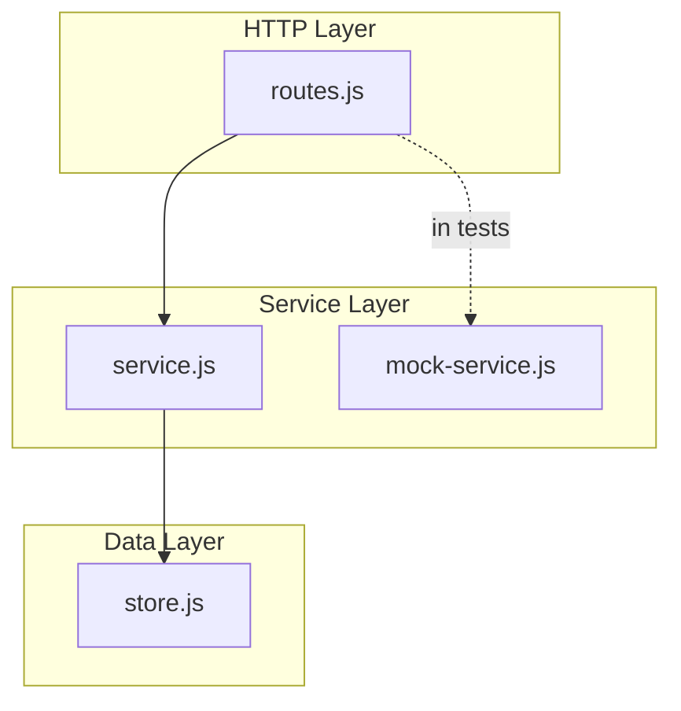

# Step 05: Update Documentation

## Goal

Update the documentation to describe the service layer architecture and how the mock service can be used for testing.

## Acceptance Criteria

- [ ] `docs/SERVER.md` includes a section on the service layer
- [ ] Service interface is documented (methods and behavior)
- [ ] Mock service usage for testing is documented
- [ ] Architecture diagram is updated to show service layer
- [ ] `npm run build` passes
- [ ] `npm test` passes

## Files to Modify

| File | Action | Purpose |
|------|--------|---------|
| `docs/SERVER.md` | Update | Add service layer documentation |

## Commands to Run

```bash
npm run build
npm test
```

## New Tests (if applicable)

None.

## Code Examples

### Documentation Section to Add

Add to `docs/SERVER.md` after the REST API section (or after Architecture):

```markdown
## Service Layer

The REST routes use a **service layer** to access item data. This abstraction allows:

- **Separation of concerns**: Routes handle HTTP; the service handles data operations
- **Testability**: A mock service can be injected for unit testing routes without the real store

### Service Interface

Both `createItemsService` (real) and `createMockItemsService` (mock) implement the same interface:

| Method | Returns | Description |
|--------|---------|-------------|
| `findAll()` | `Array` | List all items |
| `create(data)` | `Object` | Create item, return created item with id |
| `findById(id)` | `Object \| null` | Get item by id |
| `update(id, data)` | `Object \| null` | Update item, return updated item |
| `remove(id)` | `boolean` | Delete item, return true if deleted |

### Real Service

```javascript
const store = require('./rest/store.js');
const { createItemsService } = require('./rest/service.js');

const service = createItemsService(store);
```

### Mock Service (for tests)

```javascript
const { createMockItemsService } = require('./rest/mock-service.js');

// Empty mock
const service = createMockItemsService();

// Pre-populated mock
const service = createMockItemsService({
  initialItems: [{ name: 'Fixture' }]
});
```

### Architecture with Service Layer


```

## Architecture / Mermaid Diagrams

The documentation update includes the mermaid diagram above. No additional diagrams needed for this step.

## Commit Message

```
docs: add service layer documentation to SERVER.md
```
