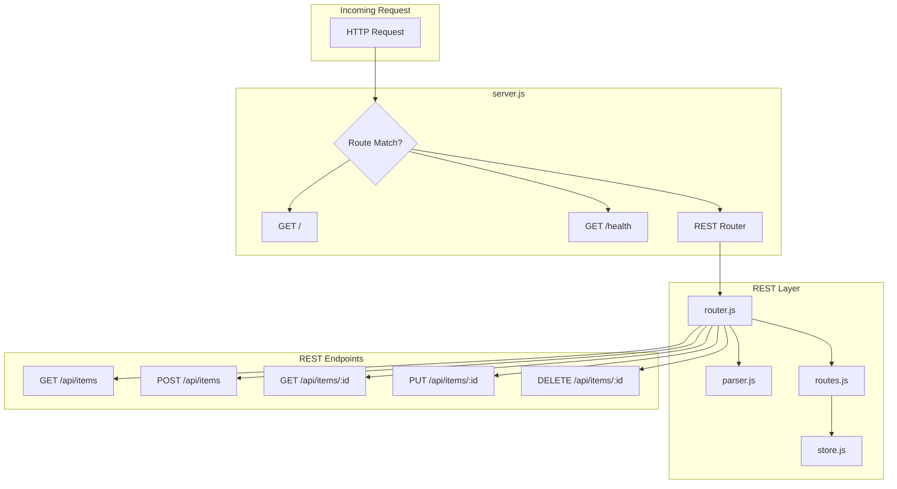
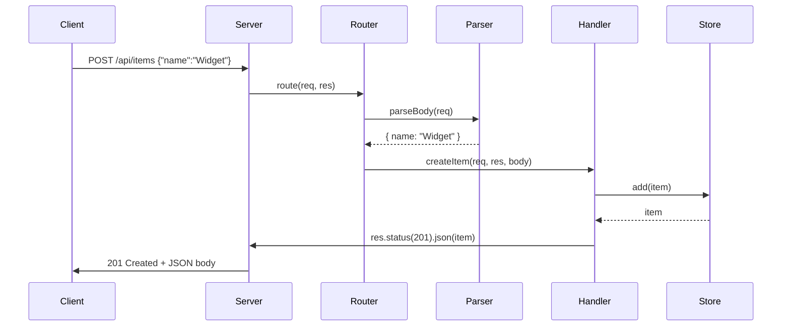
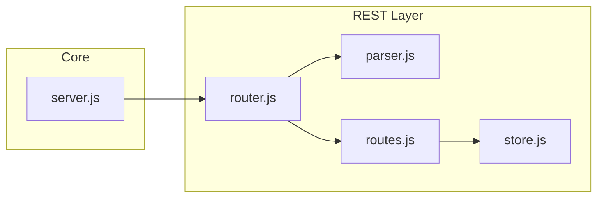
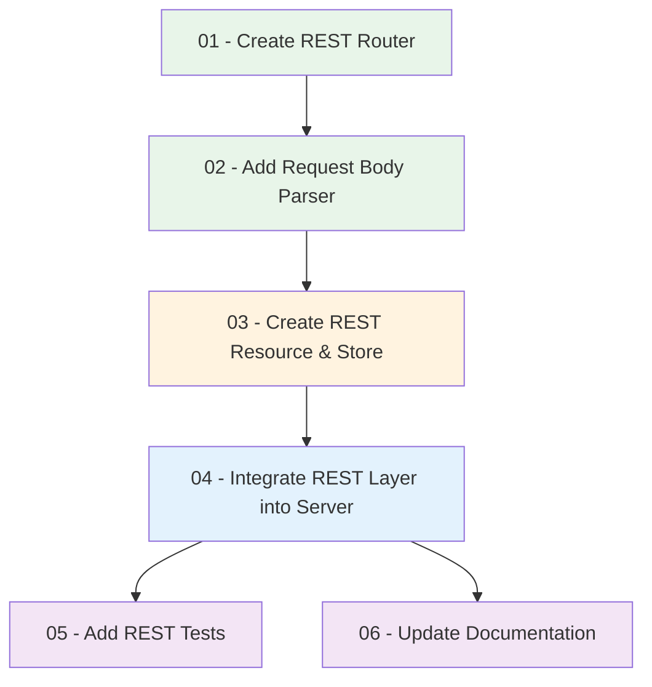

# Implementation Plan: Create REST Layer (Simple)

## High-Level Overview

This plan adds a simple REST layer to the existing HTTP server. The REST layer introduces:

- **Router**: A lightweight routing module that maps `(method, path)` to handler functions
- **Request parsing**: Utilities to parse JSON request bodies for POST/PUT/PATCH
- **Resource API**: A simple in-memory CRUD resource (e.g., `/api/items`) demonstrating REST patterns
- **Clean integration**: The REST layer plugs into the existing server without replacing `GET /` or `GET /health`

The implementation stays **dependency-free** and uses only Node.js built-in modules (`http`, `url`).

## Architecture

```
┌─────────────────────────────────────────────────────────────────────────────┐
│                           Project Structure                                  │
├─────────────────────────────────────────────────────────────────────────────┤
│  src/                                                                       │
│  ├── server.js           ← HTTP server (updated to use REST layer)           │
│  └── rest/                                                                  │
│      ├── router.js       ← Route registration & dispatch (Step 01)           │
│      ├── parser.js       ← Request body parsing (Step 02)                    │
│      ├── routes.js       ← REST route definitions & handlers (Step 03)      │
│      └── store.js        ← In-memory resource store (Step 03)               │
│  tests/                                                                     │
│  ├── server.test.js      ← Existing tests (unchanged)                       │
│  └── rest.test.js       ← REST layer tests (Step 05)                        │
│  docs/                                                                      │
│  └── SERVER.md           ← Updated with REST API docs (Step 06)             │
└─────────────────────────────────────────────────────────────────────────────┘
```

## Request Flow



## Sequence Diagram: REST Request Handling



## Component Diagram



## Step Dependencies



| Step | Depends On | Output |
|------|------------|--------|
| 01 | None | `src/rest/router.js` - routing module |
| 02 | 01 | `src/rest/parser.js` - request body parsing |
| 03 | 02 | `src/rest/store.js`, `src/rest/routes.js` - items resource & handlers |
| 04 | 03 | Updated `src/server.js` - wires REST layer |
| 05 | 04 | `tests/rest.test.js` - REST endpoint tests |
| 06 | 04 | Updated `docs/SERVER.md` - REST API documentation |

## Prerequisites

- **Node.js** v18+ installed
- **npm** for package management
- **Existing server** at `src/server.js` with `GET /` and `GET /health`
- **package.json** with scripts: `start`, `build`, `test`

## Scope

- **In scope:** REST router, request parsing, in-memory `items` resource (CRUD), integration, tests, docs
- **Out of scope:** Database persistence, authentication, complex validation, external frameworks (Express, etc.)

## REST API Endpoints (Target)

| Method | Path | Description |
|--------|------|-------------|
| GET | /api/items | List all items |
| POST | /api/items | Create item (JSON body) |
| GET | /api/items/:id | Get item by ID |
| PUT | /api/items/:id | Update item (JSON body) |
| DELETE | /api/items/:id | Delete item |

## File Summary

| File | Purpose |
|------|---------|
| `src/rest/router.js` | Route registration and dispatch by method + path |
| `src/rest/parser.js` | Parse JSON request body from readable stream |
| `src/rest/store.js` | In-memory store for items (CRUD operations) |
| `src/rest/routes.js` | Route definitions and handler functions |
| `src/server.js` | Orchestrates routing; delegates REST paths to router |
| `tests/rest.test.js` | Tests for REST endpoints |
| `docs/SERVER.md` | Updated API documentation including REST endpoints |
