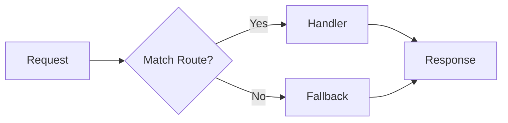

# Step 01: Create REST Router

## Goal

Create a lightweight REST router module that maps HTTP `(method, path)` pairs to handler functions. The router will support parameterized paths (e.g., `/api/items/:id`) and delegate unmatched requests to a fallback.

## Acceptance Criteria

- [ ] `src/rest/router.js` exists and exports `createRouter` and `register` methods
- [ ] Router accepts `register(method, pathPattern, handler)` where `pathPattern` uses `:id` syntax
- [ ] Router provides `route(req, res)` that matches the request and invokes the handler
- [ ] Unmatched requests are passed to a configurable fallback handler
- [ ] Matched path params (e.g., `:id`) are available to the handler via `req.params`
- [ ] `npm run build` passes
- [ ] `npm test` passes (existing tests remain green)

## Files to Modify

| File | Action | Purpose |
|------|--------|---------|
| `src/rest/router.js` | Create | Router module with route registration and dispatch |

## Commands to Run

```bash
npm run build
npm test
```

## New Tests (if applicable)

None in this step. Router will be exercised indirectly via integration in Step 04 and tested in Step 05.

## Code Examples

### Router API

```javascript
// src/rest/router.js
const { parse } = require('url');

function createRouter() {
  const routes = [];

  function register(method, pathPattern, handler) {
    const regex = pathToRegex(pathPattern);
    routes.push({ method, pathPattern, regex, handler });
  }

  function route(req, res, fallback) {
    const { pathname } = parse(req.url, true);
    const method = req.method;

    for (const { method: m, pathPattern, regex, handler } of routes) {
      if (m !== method) continue;
      const match = pathname.match(regex);
      if (match) {
        req.params = extractParams(pathPattern, match);
        return handler(req, res);
      }
    }
    return fallback(req, res);
  }

  return { register, route };
}

function pathToRegex(path) {
  const pattern = path.replace(/:(\w+)/g, '([^/]+)');
  return new RegExp(`^${pattern}$`);
}

function extractParams(pathPattern, match) {
  const names = [...pathPattern.matchAll(/:(\w+)/g)].map(m => m[1]);
  const params = {};
  names.forEach((name, i) => { params[name] = match[i + 1]; });
  return params;
}
```

### Usage (for Step 04)

```javascript
const router = createRouter();
router.register('GET', '/api/items', listItems);
router.register('POST', '/api/items', createItem);
router.register('GET', '/api/items/:id', getItem);
router.register('PUT', '/api/items/:id', updateItem);
router.register('DELETE', '/api/items/:id', deleteItem);

// In request handler:
if (req.url.startsWith('/api/')) {
  router.route(req, res, (req, res) => send404(res));
} else {
  // existing / and /health logic
}
```

## Architecture / Mermaid Diagrams



## Commit Message

```
feat(rest): add REST router with method and path routing
```
