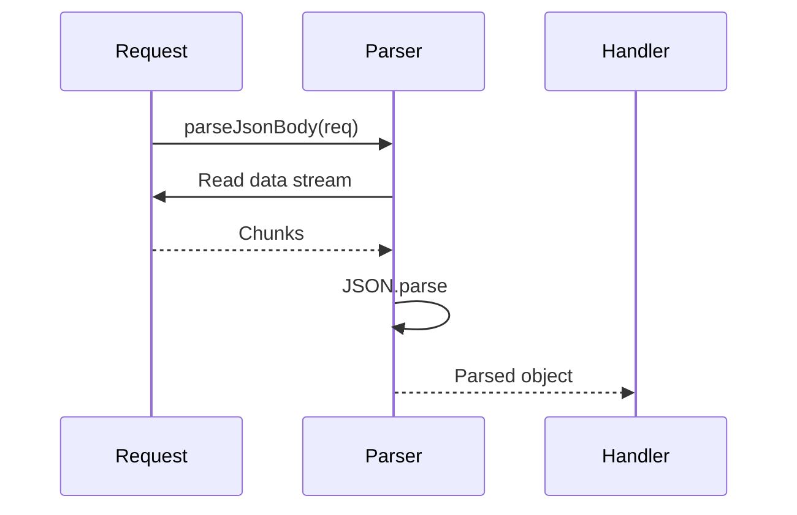

# Step 02: Add Request Body Parser

## Goal

Create a utility module to parse JSON request bodies from incoming HTTP requests. The parser will be used by POST and PUT handlers to read and validate JSON payloads.

## Acceptance Criteria

- [ ] `src/rest/parser.js` exists and exports `parseJsonBody`
- [ ] `parseJsonBody(req)` returns a Promise that resolves to the parsed object
- [ ] For requests without a body or non-JSON Content-Type, returns `null` or empty object
- [ ] For invalid JSON, rejects with a clear error or returns `null` (design choice: prefer returning `null` for simplicity)
- [ ] Handles stream correctly: collects chunks and parses once complete
- [ ] `npm run build` passes
- [ ] `npm test` passes

## Files to Modify

| File | Action | Purpose |
|------|--------|---------|
| `src/rest/parser.js` | Create | Parse JSON body from request stream |

## Commands to Run

```bash
npm run build
npm test
```

## New Tests (if applicable)

Add a simple unit test in `tests/rest.test.js` (or create `tests/parser.test.js`) to verify:
- Parsing valid JSON body
- Handling empty body
- Handling invalid JSON (expect error or null)

For minimal change, parser can be tested indirectly in Step 05 when testing POST/PUT. Step 02 can rely on `npm run build` ensuring the module loads.

## Code Examples

### Parser Implementation

```javascript
// src/rest/parser.js
function parseJsonBody(req) {
  return new Promise((resolve, reject) => {
    const contentType = req.headers['content-type'] || '';
    if (!contentType.includes('application/json')) {
      return resolve(null);
    }

    let body = '';
    req.on('data', chunk => { body += chunk; });
    req.on('end', () => {
      if (!body || body.trim() === '') {
        return resolve(null);
      }
      try {
        resolve(JSON.parse(body));
      } catch {
        resolve(null); // or reject(new Error('Invalid JSON'))
      }
    });
    req.on('error', reject);
  });
}

module.exports = { parseJsonBody };
```

### Usage in Handler (Step 03)

```javascript
const { parseJsonBody } = require('./parser.js');

async function createItem(req, res) {
  const body = await parseJsonBody(req);
  if (!body) {
    res.writeHead(400, { 'Content-Type': 'application/json' });
    res.end(JSON.stringify({ error: 'Invalid or missing JSON body' }));
    return;
  }
  // ...
}
```

## Architecture / Mermaid Diagrams



## Commit Message

```
feat(rest): add JSON request body parser
```
