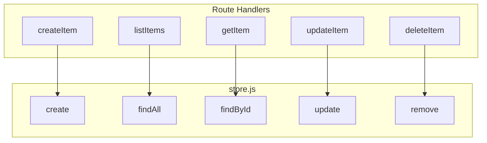

# Step 03: Create REST Resource and Store

## Goal

Create an in-memory store for a simple "items" resource and define REST route handlers that perform CRUD operations. The store and routes will be wired to the router in Step 04.

## Acceptance Criteria

- [ ] `src/rest/store.js` exists with `create`, `findAll`, `findById`, `update`, `remove`, and `reset` (for test isolation) methods
- [ ] `src/rest/routes.js` exists and exports handlers for: list, create, get, update, delete
- [ ] Store uses a simple in-memory array/Map with auto-generated IDs
- [ ] Handlers use proper HTTP status codes: 200, 201, 400, 404
- [ ] Handlers send JSON responses with `Content-Type: application/json`
- [ ] POST and PUT handlers use `parseJsonBody` for request body
- [ ] `npm run build` passes
- [ ] `npm test` passes

## Files to Modify

| File | Action | Purpose |
|------|--------|---------|
| `src/rest/store.js` | Create | In-memory CRUD store for items |
| `src/rest/routes.js` | Create | Route handlers for items REST API |

## Commands to Run

```bash
npm run build
npm test
```

## New Tests (if applicable)

None in this step. Handlers will be exercised via integration in Step 04 and tested in Step 05.

## Code Examples

### Store Implementation

```javascript
// src/rest/store.js
let items = [];
let nextId = 1;

function create(item) {
  const newItem = { id: String(nextId++), ...item };
  items.push(newItem);
  return newItem;
}

function findAll() {
  return [...items];
}

function findById(id) {
  return items.find(item => item.id === id) ?? null;
}

function update(id, data) {
  const index = items.findIndex(item => item.id === id);
  if (index === -1) return null;
  items[index] = { ...items[index], ...data, id };
  return items[index];
}

function remove(id) {
  const index = items.findIndex(item => item.id === id);
  if (index === -1) return false;
  items.splice(index, 1);
  return true;
}

function reset() {
  items = [];
  nextId = 1;
}

module.exports = { create, findAll, findById, update, remove, reset };
```

### Routes Implementation

```javascript
// src/rest/routes.js
const { parseJsonBody } = require('./parser.js');
const store = require('./store.js');

function sendJson(res, statusCode, data) {
  res.writeHead(statusCode, { 'Content-Type': 'application/json' });
  res.end(JSON.stringify(data));
}

async function listItems(req, res) {
  const items = store.findAll();
  sendJson(res, 200, items);
}

async function createItem(req, res) {
  const body = await parseJsonBody(req);
  if (!body || typeof body !== 'object') {
    return sendJson(res, 400, { error: 'Invalid or missing JSON body' });
  }
  const item = store.create(body);
  sendJson(res, 201, item);
}

async function getItem(req, res) {
  const { id } = req.params || {};
  const item = store.findById(id);
  if (!item) return sendJson(res, 404, { error: 'Not found' });
  sendJson(res, 200, item);
}

async function updateItem(req, res) {
  const { id } = req.params || {};
  const body = await parseJsonBody(req);
  if (!body || typeof body !== 'object') {
    return sendJson(res, 400, { error: 'Invalid or missing JSON body' });
  }
  const item = store.update(id, body);
  if (!item) return sendJson(res, 404, { error: 'Not found' });
  sendJson(res, 200, item);
}

async function deleteItem(req, res) {
  const { id } = req.params || {};
  const ok = store.remove(id);
  if (!ok) return sendJson(res, 404, { error: 'Not found' });
  res.writeHead(204);
  res.end();
}

module.exports = { listItems, createItem, getItem, updateItem, deleteItem };
```

## Architecture / Mermaid Diagrams



## Commit Message

```
feat(rest): add items store and REST route handlers
```
