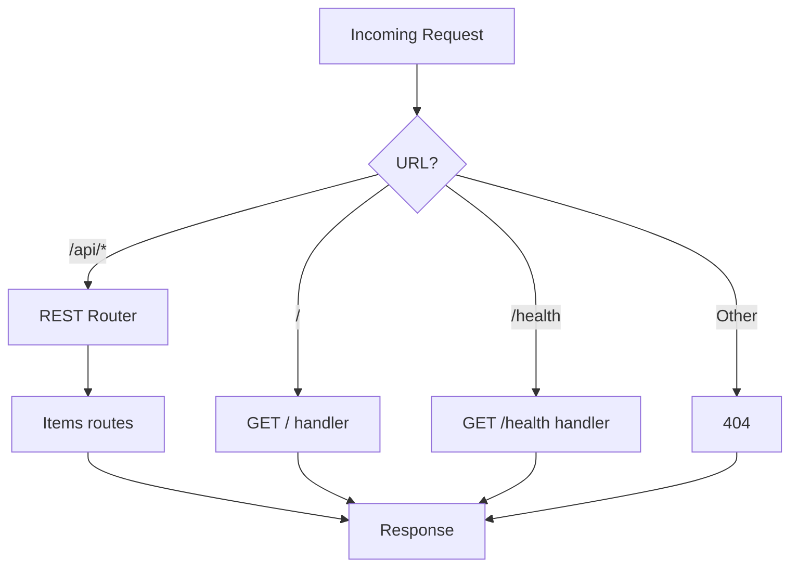

# Step 04: Integrate REST Layer into Server

## Goal

Wire the REST router, routes, and handlers into the main server. Requests to `/api/*` are delegated to the REST layer; existing `GET /` and `GET /health` remain unchanged.

## Acceptance Criteria

- [ ] `src/server.js` imports and uses the REST router
- [ ] Requests to `/api/items` and `/api/items/:id` are handled by the REST layer
- [ ] `GET /` and `GET /health` behave exactly as before
- [ ] Unmatched `/api/*` paths return 404
- [ ] All existing tests in `tests/server.test.js` pass
- [ ] `npm run build` passes
- [ ] `npm test` passes

## Files to Modify

| File | Action | Purpose |
|------|--------|---------|
| `src/server.js` | Update | Integrate REST router and route handlers |

## Commands to Run

```bash
npm run build
npm test
```

## New Tests (if applicable)

None in this step. New REST tests go in Step 05. Existing server tests must remain green.

## Code Examples

### Server Integration

```javascript
// src/server.js
const http = require('http');
const { createRouter } = require('./rest/router.js');
const routes = require('./rest/routes.js');

const PORT = process.env.PORT || 3000;

const router = createRouter();
router.register('GET', '/api/items', routes.listItems);
router.register('POST', '/api/items', routes.createItem);
router.register('GET', '/api/items/:id', routes.getItem);
router.register('PUT', '/api/items/:id', routes.updateItem);
router.register('DELETE', '/api/items/:id', routes.deleteItem);

function send404(res) {
  res.writeHead(404, { 'Content-Type': 'application/json' });
  res.end(JSON.stringify({ error: 'Not found' }));
}

const server = http.createServer((req, res) => {
  if (req.method === 'GET' && req.url === '/') {
    res.writeHead(200, { 'Content-Type': 'text/plain' });
    res.end('Welcome to the simple server!');
    return;
  }
  if (req.method === 'GET' && req.url === '/health') {
    res.writeHead(200, { 'Content-Type': 'application/json' });
    res.end(JSON.stringify({ status: 'ok' }));
    return;
  }
  if (req.url.startsWith('/api/')) {
    router.route(req, res, () => send404(res));
    return;
  }
  res.writeHead(404);
  res.end('Not Found');
});

if (require.main === module) {
  server.listen(PORT, () => {
    console.log(`Server running at http://localhost:${PORT}`);
  });
}

module.exports = { server, PORT };
```

### Router Path Params Fix

Ensure `router.js` passes `pathPattern` into `extractParams`. The `route` loop needs access to `pathPattern`:

```javascript
for (const { method: m, pathPattern, regex, handler } of routes) {
  if (m !== method) continue;
  const match = pathname.match(regex);
  if (match) {
    req.params = extractParams(pathPattern, match);
    return handler(req, res);
  }
}
```

## Architecture / Mermaid Diagrams



## Commit Message

```
feat(rest): integrate REST layer into server
```
