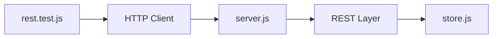

# Step 05: Add REST Tests

## Goal

Add comprehensive tests for the REST API endpoints. Tests cover all CRUD operations on `/api/items` and verify status codes, response bodies, and error handling.

## Acceptance Criteria

- [ ] `tests/rest.test.js` exists
- [ ] GET /api/items returns 200 and empty array when no items
- [ ] POST /api/items with valid JSON returns 201 and created item with id
- [ ] GET /api/items/:id returns 200 and item when found
- [ ] GET /api/items/:id returns 404 when not found
- [ ] PUT /api/items/:id returns 200 and updated item when found
- [ ] PUT /api/items/:id returns 404 when not found
- [ ] DELETE /api/items/:id returns 204 when found
- [ ] DELETE /api/items/:id returns 404 when not found
- [ ] POST /api/items with invalid JSON returns 400
- [ ] Unmatched /api/* path returns 404
- [ ] `npm run build` passes
- [ ] `npm test` passes (all tests including server and rest)

## Files to Modify

| File | Action | Purpose |
|------|--------|---------|
| `tests/rest.test.js` | Create | REST API endpoint tests |
| `package.json` | Update | Change test script to run all test files: `node --test tests/server.test.js tests/rest.test.js` |

## Commands to Run

```bash
npm run build
npm test
```

## New Tests (if applicable)

All tests described in Acceptance Criteria. Use the same pattern as `server.test.js`: start server on random port, make HTTP requests, assert status and body, stop server.

## Code Examples

### Test Helpers

```javascript
// tests/rest.test.js
const { describe, it, before, after } = require('node:test');
const assert = require('node:assert');
const http = require('http');

const { server } = require('../src/server.js');
const store = require('../src/rest/store.js');

function makeRequest(port, path, options = {}) {
  return new Promise((resolve, reject) => {
    const { method = 'GET', body } = options;
    const url = new URL(path, `http://localhost:${port}`);
    const req = http.request({
      hostname: url.hostname,
      port: url.port,
      path: url.pathname,
      method,
      headers: body ? { 'Content-Type': 'application/json' } : {}
    }, (res) => {
      let data = '';
      res.on('data', (chunk) => { data += chunk; });
      res.on('end', () => resolve({ statusCode: res.statusCode, body: data }));
    });
    req.on('error', reject);
    if (body) req.write(typeof body === 'string' ? body : JSON.stringify(body));
    req.end();
  });
}

function startServer(port) {
  return new Promise((resolve) => {
    server.listen(port, () => resolve(server.address().port));
  });
}

function stopServer() {
  return new Promise((resolve) => server.close(() => resolve()));
}
```

### Test Cases (Pseudocode)

```javascript
describe('REST API /api/items', () => {
  let port;
  before(async () => {
    store.reset();
    port = await startServer(0);
  });
  after(() => stopServer());

  it('GET /api/items returns 200 and empty array', async () => {
    const { statusCode, body } = await makeRequest(port, '/api/items');
    assert.strictEqual(statusCode, 200);
    assert.deepStrictEqual(JSON.parse(body), []);
  });

  it('POST /api/items creates item and returns 201', async () => {
    const { statusCode, body } = await makeRequest(port, '/api/items', {
      method: 'POST',
      body: { name: 'Widget' }
    });
    assert.strictEqual(statusCode, 201);
    const item = JSON.parse(body);
    assert.ok(item.id);
    assert.strictEqual(item.name, 'Widget');
  });

  it('GET /api/items/:id returns 200 when found', async () => {
    const create = await makeRequest(port, '/api/items', {
      method: 'POST',
      body: { name: 'Test' }
    });
    const item = JSON.parse(create.body);
    const { statusCode, body } = await makeRequest(port, `/api/items/${item.id}`);
    assert.strictEqual(statusCode, 200);
    assert.strictEqual(JSON.parse(body).name, 'Test');
  });

  it('GET /api/items/999 returns 404', async () => {
    const { statusCode } = await makeRequest(port, '/api/items/999');
    assert.strictEqual(statusCode, 404);
  });

  it('PUT /api/items/:id updates and returns 200', async () => {
    const create = await makeRequest(port, '/api/items', {
      method: 'POST',
      body: { name: 'Original' }
    });
    const created = JSON.parse(create.body);
    const { statusCode, body } = await makeRequest(port, `/api/items/${created.id}`, {
      method: 'PUT',
      body: { name: 'Updated' }
    });
    assert.strictEqual(statusCode, 200);
    assert.strictEqual(JSON.parse(body).name, 'Updated');
  });

  it('DELETE /api/items/:id returns 204 when found', async () => {
    const create = await makeRequest(port, '/api/items', {
      method: 'POST',
      body: { name: 'ToDelete' }
    });
    const item = JSON.parse(create.body);
    const { statusCode, body } = await makeRequest(port, `/api/items/${item.id}`, {
      method: 'DELETE'
    });
    assert.strictEqual(statusCode, 204);
    assert.strictEqual(body, '');
  });

  it('POST with invalid JSON returns 400', async () => {
    const { statusCode } = await makeRequest(port, '/api/items', {
      method: 'POST',
      body: 'not json'
    });
    assert.strictEqual(statusCode, 400);
  });

  it('GET /api/unknown returns 404', async () => {
    const { statusCode } = await makeRequest(port, '/api/unknown');
    assert.strictEqual(statusCode, 404);
  });
});
```

**Note:** Use `before`/`after` or per-test `startServer`/`stopServer` consistent with `server.test.js`. The existing server tests start/stop per test; REST tests may share one server instance since the store is in-memory and tests can run sequentially. Consider whether the server needs to be independent per test file—if tests run in parallel, each file may need its own server. Check Node test runner behavior: by default tests in the same file run sequentially unless configured otherwise.

For simplicity, start server once per describe block and stop after all tests. Call `store.reset()` in `before` to ensure each test file run has a clean store (tests may run in parallel with other files, so per-test reset is optional if tests are designed to be independent).

## Architecture / Mermaid Diagrams



## Commit Message

```
test(rest): add REST API endpoint tests
```
