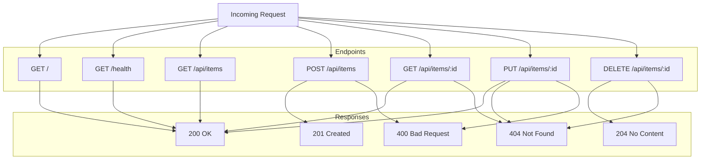

# Step 06: Update Documentation

## Goal

Update `docs/SERVER.md` to document the new REST API endpoints. The documentation should include endpoint descriptions, request/response formats, and status codes.

## Acceptance Criteria

- [ ] `docs/SERVER.md` includes a "REST API" section
- [ ] All five endpoints (GET list, POST create, GET by id, PUT update, DELETE) are documented
- [ ] Request body format and Content-Type are specified for POST and PUT
- [ ] Response formats and status codes (200, 201, 204, 400, 404) are documented
- [ ] Architecture diagram updated to include REST endpoints
- [ ] `npm run build` passes
- [ ] `npm test` passes

## Files to Modify

| File | Action | Purpose |
|------|--------|---------|
| `docs/SERVER.md` | Update | Add REST API documentation |

## Commands to Run

```bash
npm run build
npm test
```

## New Tests (if applicable)

None.

## Code Examples

### Documentation Addition

```markdown
## REST API

The server exposes a simple REST API for managing items at `/api/items`. All REST responses use `Content-Type: application/json`.

### GET /api/items

List all items.

**Response:** `200 OK`
- Body: Array of item objects, e.g. `[{ "id": "1", "name": "Widget" }]`

### POST /api/items

Create a new item.

**Request:**
- Content-Type: application/json
- Body: JSON object with item properties (e.g. `{ "name": "Widget" }`)

**Response:** `201 Created`
- Body: Created item with `id` and other properties

**Error:** `400 Bad Request` if body is invalid or missing JSON

### GET /api/items/:id

Get item by ID.

**Response:** `200 OK`
- Body: Item object

**Error:** `404 Not Found` if item does not exist

### PUT /api/items/:id

Update an item.

**Request:**
- Content-Type: application/json
- Body: JSON object with properties to update

**Response:** `200 OK`
- Body: Updated item

**Error:** `404 Not Found` if item does not exist
**Error:** `400 Bad Request` if body is invalid or missing JSON

### DELETE /api/items/:id

Delete an item.

**Response:** `204 No Content`
- No body

**Error:** `404 Not Found` if item does not exist
```

### Updated Architecture Diagram

```markdown
## Architecture


```

## Architecture / Mermaid Diagrams

Documentation update only; no new architecture. The SERVER.md mermaid diagram is updated to reflect REST endpoints.

## Commit Message

```
docs: add REST API documentation to SERVER.md
```
